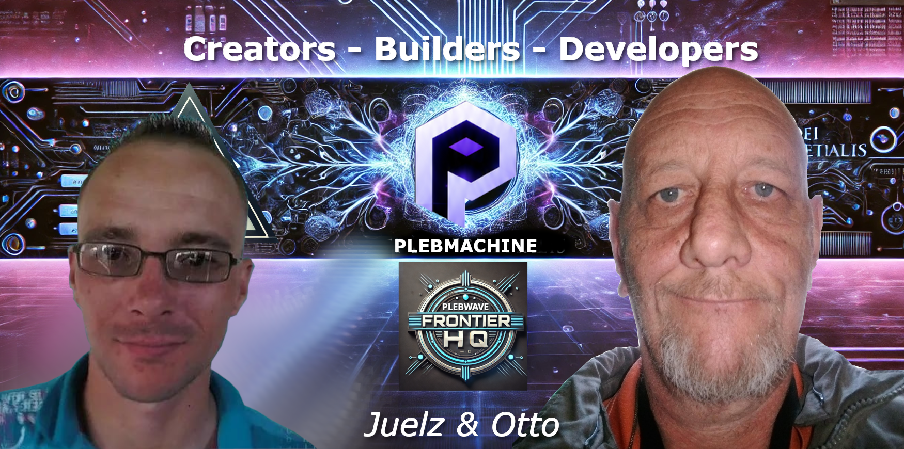

# 🖥️ PLEBWARE CONTROL CENTER
---
## 🌐 Plebware Links | ⚙️ [🖥️ PlebMachine System Core](https://Plebware.github.io/PlebMachine/) | ✍️  [📚 Otto Archive](https://Plebware.github.io/otto.md/)
---

# 🧭 The Origin of Plebware

Plebware began as an idea rooted in practicality rather than commercial ambition.

The concept emerged from years of working with ageing hardware, lightweight Linux systems, and the growing frustration with increasingly bloated, restrictive, and resource-heavy computing environments.

The original vision was simple:

> Build systems for ordinary people using ordinary hardware.

The word “Plebware” itself was chosen deliberately.

It was inspired by the idea that technology should remain accessible to everyday users rather than becoming exclusive, disposable, or dependent on expensive ecosystems.

---

## ⚙️ Early Foundations

The foundations of Plebware were shaped through real-world technical experience:

- railway electrical systems
- mechanical troubleshooting
- hardware repair
- Linux experimentation
- lightweight computing
- practical engineering philosophy

These experiences reinforced a core belief:

> Reliability matters more than hype.

Rather than chasing trends, the focus became:
- maintainability
- resilience
- clarity
- recoverability
- efficient workflows

---

## 🖥️ The Linux Influence

Linux became the natural platform for experimentation.

Over time, lightweight desktop environments and modular workflows proved that older machines could still remain productive and useful when systems were designed intelligently.

MX Linux and XFCE eventually became central pillars of the project because they aligned with the philosophy of:

- stability
- flexibility
- low resource consumption
- user control

---

## 🧩 From Idea to Ecosystem

What started as experimentation slowly evolved into a broader ecosystem involving:

- modular desktop orchestration
- workflow automation
- AI-assisted productivity
- GitHub documentation systems
- technical archives
- creative writing integration
- operational control center concepts

This evolution eventually became known as:

# ⚙️ PlebMachine

A modular Linux orchestration framework designed around practical workflows and human-centered computing.

---

## 🧠 Philosophy of the Project

Plebware does not aim to compete with large corporate operating systems or enterprise platforms.

Its purpose is different.

The project exists to explore:

- sustainable computing
- accessible workflows
- practical automation
- clarity in system design
- long-term usability
- lightweight engineering

At its core, Plebware is an ongoing experiment in building systems that remain understandable and adaptable instead of becoming increasingly opaque and disposable.

---

## 🌍 Human-Centered Technology

One of the defining ideas behind Plebware is that technology should support human capability rather than overwhelm it.

Complexity should serve a purpose.

Systems should remain:
- readable
- repairable
- maintainable
- understandable

The ecosystem intentionally favors practical solutions over unnecessary abstraction.

---

## 🚀 Continuing Evolution

Plebware continues to evolve through experimentation, documentation, writing, and technical exploration.

The project remains intentionally independent and adaptive.

There is no rigid roadmap.

Only ongoing development driven by curiosity, resilience, and the desire to build technology that remains grounded in human needs rather than corporate trends.

---

# 🖥️ PlebMachine
Human-Centred Linux Engineering

## ⚡ System Status

| Module | Status |
|---|---|
| ⚙️ PlebMachine Core | Operational |
| 📚 Documentation | Active |
| ✍️ Otto Archive | Online |
| 🧠 AI Integration | Experimental |

---

## 🌐 Active Networks

### ⚙️ Technical Core
- [🖥️ PlebMachine System Core](https://Plebware.github.io/PlebMachine/)

### ✍️ Writing & Fiction
- [📚 Otto Archive](https://Plebware.github.io/otto.md/)

---

## 🚀 Quick Access

- 📖 Documentation
- 🧪 Experiments
- 🛠️ Projects
- 📝 Devlogs
